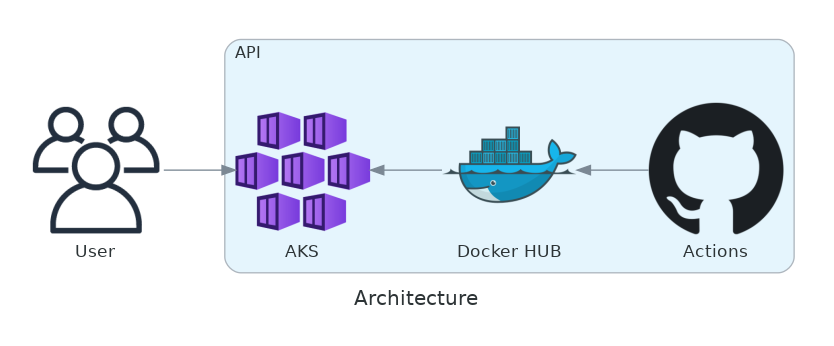

# Template project: api-with-github-actions-and-azure-aks
This project is a robust API application, containerized with Docker for easy deployment and scalability managed by Kubernetes. Code quality and functionality are ensured through automated tests run by GitHub Actions upon each commit, and the application is hosted on Azure.

[](https://www.python.org/downloads/release/python-31010/)


## Technology and Resources

- [Python 3.10](https://www.python.org/downloads/release/python-31010/) - **pre-requisite**
- [Docker](https://www.docker.com/get-started) - **pre-requisite**
- [Pipenv](https://github.com/pypa/pipenv)
- [FastAPI](https://github.com/tiangolo/fastapi)
- [Uvicorn](https://github.com/encode/uvicorn)


## Architecture




#### Updating diagram

This diagram is based on python's [Diagrams](https://diagrams.mingrammer.com/).

The source file is located at `.docs/diagrams/architecture.png` and `make diagram` will render the new `.docs/diagrams/architecture.png` file.

- [graphviz](https://graphviz.org/download/) - **pre-requisite**


### API Docs

#### Routes

- `/`: The root path is a redirect to `/docs`
- `/docs`: Swagger Docs
- `/redoc`: Redoc Docs
- `/health-check`: Verify sure the application is up


## Running Docker

### How to Build Docker

```
make build
```

### How to Run

```
make run
```

### How to Test

```
make tests
```

_The project will be running at `http://localhost:8000/`_

The `entrypoint` of this project is the `run.py` file on the root path.


## Extras infos

The documentation was inspired by the [fastapi-simple-starter-project](https://github.com/eduardomatoss/fastapi-simple-starter-project) repository.